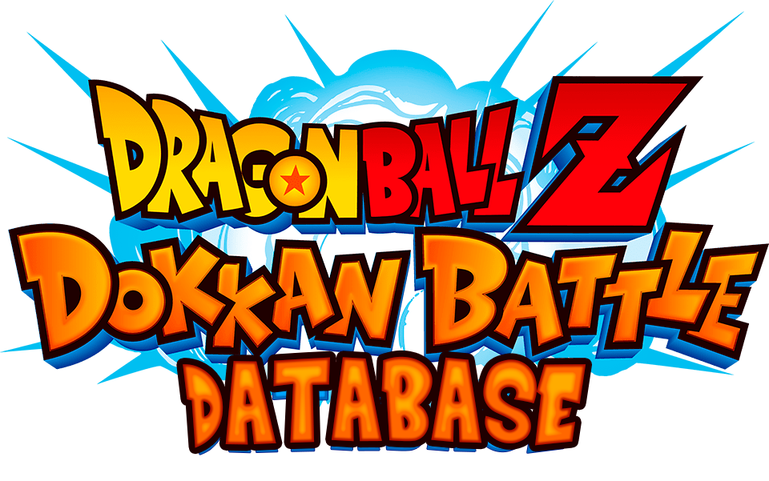

# Proyecto fin de ciclo

## Descripción

Con este proyecto quiero lograr hacer una base de datos cómoda y accesible para todos los jugadores del juego de móvil Dragon Ball Z Dokkan Battle. Con ella podrán ver todas las cartas del juego, junto a su respectiva información, animaciones, cartas con las que comparten más links, eventos, banners, etc…

Dentro de este repositorio puedes encontrar el logo que he usado como base y el archivo de photoshop de mi logo. Además también puedes acceder al archivo [DokkanBattleDatabase](DokkanBattleDatabase.pdf) para ver el wireframe de mi página.

## Por qué?

Básicamente los usuarios podrán acceder a todos los datos del juego desde el mismo sitio, ya que hoy en día hay unas pocas aplicaciones o sitios web que te permiten ver este tipo de cosas y los que hay carecen de algunas características que, en mi opinión, son bastante importantes.

## Objetivo

Conseguir que se pueda acceder a toda la información de este juego no es un proceso rápido y sencillo, ya que hay muchas cartas, eventos, animaciones, etc… Planeo continuar implementando funciones y expandiendo esta aplicación en un futuro, así que intentaré implementar todas las funciones posibles antes de la fecha de entrega.

## Enlaces importantes

> Puedes visitar este [enlace](https://www.figma.com/design/AHmHulmTDvxvst44m947ur/Dokkan-Battle-Database?node-id=601%3A7&t=BI2UnGOKhrHX7gmC-1) para ver, más o menos, como tengo pensado que acabe siendo la página.
